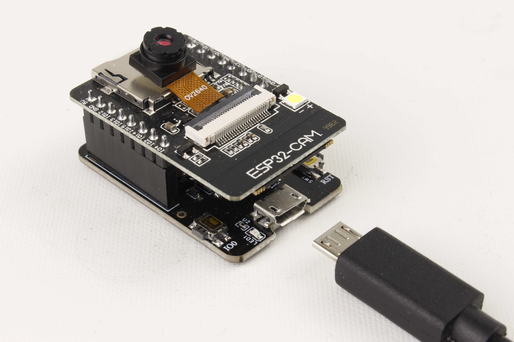

Maker Media GmbH

***

# E-Mail-Kamera

## Ein Make-Projekt mit der ESP32-CAM

Im Gegensatz zu herkömmlichen Kameras ist die ESP32-CAM frei programmierbar. In Kombination mit WLAN ist das eine gute Basis für spannende Projekte, wie zum Beispiel eine Kamera, die Fotos automatisch per E-Mail versendet und die man per Touch auslöst.

Hier gibt es den Code zum Projekt im Ordner _src_.

Es ist zusätzlich die Installation der Bibliothek [ESP Mail Client](https://github.com/mobizt/ESP-Mail-Client) von _Mobizt_ über den Bibliotheksverwalter der Arduino IDE nötig. Eine Anleitung dazu gibt es [hier](https://heise.de/-9242659).

Der vollständige Artikel zum Projekt steht im **Make-Special ESP32-CAM 2023** ab Seite 22.
